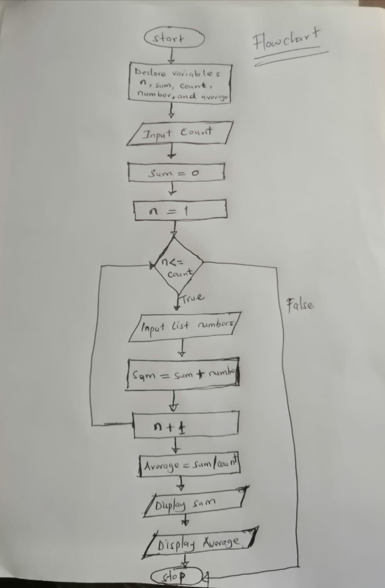

# Given the pseudocode, design an algorithm and its corresponding flowchart

    **Use Variables:** n, count of the type integer sum, number, average of type real

    **Display:** "How many numbers do you want to input"

    **Accept** count

    **sum =** 0

    **FOR** (n=1, n<=count, n+1)

    **Display:** "Input number from your list"

    **Accept** number

    **sum =** sum + number

    **ENDFOR** 

    **Average =** sum/count

    **Display:** "The sum of the number is", sum

    **Display:** "The average of the number is", Average

## Solution

### Algorithm

**Step 1:** Start

**Step 2:** Declare integer variables n,count,sum and numbers

**Step 3:** Declare real variables average

**Step 4:** Accept number input

**Step 5:** Read count

**Step 6:** Initialize sum = 0

**Step 7:** Initialize n = 1

**Step 8:** If n <= count

- Step 8.1: Accept list numbers

- Step 8.2: Read numbers

- Step 8.3: Add sum to number

- Step 8.4: Increament n

**Else**

- Step 8.5: Stop

**Step 9:** Average = sum divide by count

**Step 10:** Display sum

**Step 11:** Display Average

**Step 12:** Stop

### Flowchart



## Program

### C Language
```text
#include <stdio.h>

int main() {
    int n, sum,count,number;
    float average;
    printf("How many numbers do you want to input: ");
    scanf("%d", &count);
    sum =0;
    for(n=1;n<=count;n++){
        printf("Input the numbers from your list: ");
        scanf("%d", &number);
        sum = sum + number;
    }
    average = sum/count;
    printf("Sum of the number is: %d", sum);
    printf("Average of the number is: %d", average);
    return 0;
}
```

### Python Code
```text
def numbers():
    count = int(input("How Many numbers\n"))
    sum = 0
    for i in range(0, count):
        numbers = int(input("How many numbers\n"))
        sum = sum + numbers
        count = count + 1
    average = sum/count
    print("Sum is", sum)
    print("average is", average)
numbers()
```